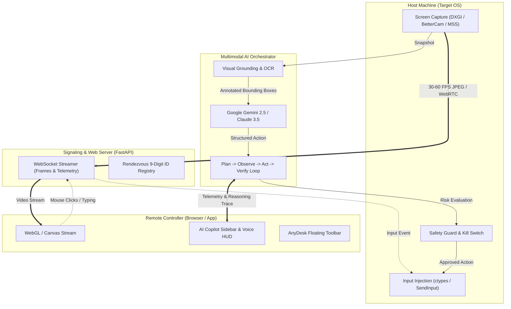

# 📚 Master Project Documentation — AI Remote Desktop Assistant

> **Software**: Python-Based Autonomous & Generative AI Remote Desktop Software (AnyDesk Paradigm)  
> **Version**: 1.0.0  
> **Target Audience**: AI Agents, Core Contributors, Developers, and DevOps Engineers

---

## 1. Executive Summary & Core Mission

This repository implements a **Python-Based, AnyDesk-Style Remote Desktop Application** with an integrated **Multimodal Generative AI Copilot ("Computer Use")**. 

It brings together:
1. **Classic AnyDesk Telepresence**: 9-digit Device ID (e.g. `982 411 723`), Rendezvous/P2P NAT traversal, 60 FPS screen streaming (`bettercam` / `mss` / `aiortc`), sub-10ms direct mouse/keyboard input forwarding, split-pane file transfer, and in-session OS control toolbars.
2. **Generative AI Copilot**: Multimodal vision perception (Gemini 2.5/1.5 Pro/Flash, Claude 3.5 Sonnet, Local VLMs), OCR / Visual Grounding (OmniParser/RapidOCR), natural language and voice dialog (Whisper STT + Edge-TTS), and step-by-step GUI automation with human-in-the-loop (HITL) safety verification.
3. **100% Python Engine**: All server components, host daemons, capture engines, AI orchestration, and desktop GUI shells are built in Python (Python 3.10+).

---

## 2. Comprehensive Documentation Map

All specifications, engineering designs, and manuals are located in the [`doc/`](file:///e:/python%20remote%20desktop%20assitant/doc) directory:

| Document | Key Topics Covered |
| :--- | :--- |
| [**`doc/user_manual.md`**](file:///e:/python%20remote%20desktop%20assitant/doc/user_manual.md) | **End-User Guide**: Installation, Home Dashboard navigation, in-session floating toolbar, voice push-to-talk, emergency killswitch, and troubleshooting. |
| [**`doc/system_architecture.md`**](file:///e:/python%20remote%20desktop%20assitant/doc/system_architecture.md) | **Architecture Blueprint**: Tripartite topology, Rendezvous P2P/Relay server, WebRTC channels, AI OODA loop, and security architecture. |
| [**`doc/feature_specifications.md`**](file:///e:/python%20remote%20desktop%20assitant/doc/feature_specifications.md) | **Product Requirements**: Epics 1–7, acceptance criteria (Given-When-Then), structured action schemas, and error recovery policies. |
| [**`doc/tech_stack_and_engine.md`**](file:///e:/python%20remote%20desktop%20assitant/doc/tech_stack_and_engine.md) | **Technology Manifest**: Python libraries (`FastAPI`, `aiortc`, `bettercam`, `google-genai`, `pywin32`), hardware acceleration, and dependency specs. |
| [**`doc/ui_ux_design.md`**](file:///e:/python%20remote%20desktop%20assitant/doc/ui_ux_design.md) | **Design System & Wireframes**: Glassmorphism dark tokens, AnyDesk Home Dashboard, in-session toolbar, AI Copilot drawer, and micro-animations. |
| [**`doc/testing_and_verification.md`**](file:///e:/python%20remote%20desktop%20assitant/doc/testing_and_verification.md) | **Quality Assurance**: Unit test suites, headless synthetic OS mock harness, coordinate accuracy tests, and CI/CD pipeline. |
| [**`doc/geographical_wan_deployment.md`**](file:///e:/python%20remote%20desktop%20assitant/doc/geographical_wan_deployment.md) | **Global WAN Guide**: Connecting across different countries/NATs via STUN/TURN, Cloudflare Tunnels, Tailscale, and Rendezvous servers. |
| [**`AGENTS.md`**](file:///e:/python%20remote%20desktop%20assitant/AGENTS.md) | **AI Agent Operating Rules**: Coding conventions, directory structure, coordinate math rules, and Definition of Done. |

---

## 3. System Architecture & Component Interactions



---

## 4. Directory & Module Reference

```
├── doc/                                # Authoritative documentation & specs
│   ├── user_manual.md                  # Comprehensive end-user guide
│   ├── project_documentation.md        # Master project documentation
│   ├── system_architecture.md          # Architecture & data flows
│   ├── feature_specifications.md       # Epics & acceptance criteria
│   ├── tech_stack_and_engine.md        # Libraries & dependency manifest
│   ├── ui_ux_design.md                 # Design system & wireframes
│   ├── testing_and_verification.md     # Test harness & benchmark specs
│   └── geographical_wan_deployment.md  # Worldwide WAN deployment
├── config/                             # Configuration files
│   ├── settings.example.yaml           # Runtime server settings
│   └── safety_policies.yaml            # Risk tier rules & blacklists
├── src/                                # Source code
│   ├── main.py                         # Application CLI & launcher
│   ├── common/                         # Logger, types, config
│   ├── host_engine/                    # Screen capture & input controller
│   ├── ai_brain/                       # Multimodal reasoning & execution loop
│   ├── server/                         # FastAPI & Rendezvous signaling
│   └── client_ui/                      # Web viewer & cyber-glassmorphic UI
├── tests/                              # Automated tests
├── requirements.txt                    # Pinned dependencies
├── pyproject.toml                      # Packaging & tools configuration
├── AGENTS.md                           # AI agent operating rules
└── README.md                           # Project landing page
```

---

## 5. Security & Safety Principles

1. **Deterministic Coordinate Mapping**: AI models reason on $[0.0, 1.0]$ normalized grids, translated accurately to native integer screen coordinates considering display DPI scaling.
2. **Three-Tier Action Guardrails**: Safe navigation actions execute automatically; destructive operations (file deletion, terminal commands, purchases) require explicit human approval via modal.
3. **Emergency Stop (Hardware & UI)**: Pressing `Esc + Esc` or clicking the glowing red Stop button terminates all in-flight inputs in $< 20\text{ ms}$.
4. **End-to-End Encryption**: Data channels and media streams use **DTLS-SRTP** and **TLS 1.3** to protect user data.
