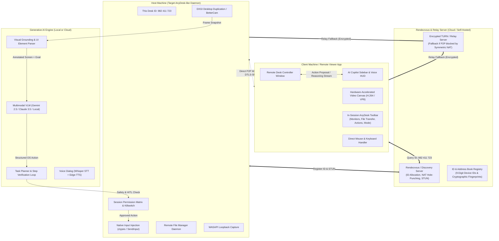
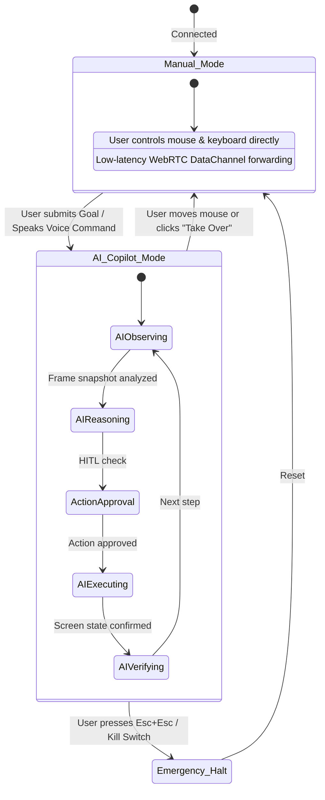
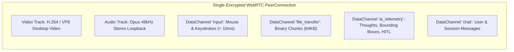

# System Architecture — AI-Powered Remote Desktop (AnyDesk Paradigm)

> **Status**: Approved Blueprint  
> **Software Category**: Next-Gen AnyDesk/RustDesk Alternative with Built-in Generative AI Multimodal Copilot  
> **Target Version**: 1.0.0

---

## 1. High-Level System Architecture & AnyDesk Topology

The architecture mirrors the industry-standard **AnyDesk / RustDesk** remote desktop model (Rendezvous Signaling, P2P NAT Traversal / Relay, Host & Client Engine) augmented with an **Autonomous Multimodal Generative AI Copilot**:



---

## 2. AnyDesk-Style Core Subsystems

### 2.1. 9-Digit Device ID & Cryptographic Handshake
Just like AnyDesk, every host running the software receives a persistent **9-digit Device ID** (e.g., `982 411 723`) and an optional human-readable alias (e.g., `arindam-workstation@desk`):

```mermaid
sequenceDiagram
    autonumber
    participant Host as Host Machine (Desk ID: 982 411 723)
    participant Server as Rendezvous Server (Signaling)
    participant Client as Remote Controller Client

    Host->>Server: Register Host ID (Public Key Fingerprint, Local IP, NAT Mapping)
    Server-->>Host: ID Registration Confirmed (Active Keep-Alive)
    
    Note over Client,Server: User enters Remote Desk ID: 982 411 723
    Client->>Server: Connect Request -> Target: 982 411 723
    Server->>Host: Incoming Connection Notification (from Client Public Key)
    Host-->>Client: Request Authentication (One-Time Access Token / Unattended Password)
    Client->>Host: Authenticate via Encrypted Token
    
    Note over Host,Client: NAT Hole Punching (P2P WebRTC)
    Host->>Client: ICE Candidates / Direct P2P Channel Established
    Host==>>Client: Video Stream (Desktop) + Audio Stream + DataChannels (Input, File, Chat, AI)
```

---

### 2.2. In-Session Permission Matrix (AnyDesk Security Model)

When a connection is established, the host administrator configures or enforces granular permissions for the incoming remote session or AI Copilot:

| Permission Flag | Default | Description |
| :--- | :--- | :--- |
| `ALLOW_MOUSE_KEYBOARD` | `true` | Remote user or AI can move cursor and send keystrokes |
| `ALLOW_CLIPBOARD_SYNC` | `true` | Bidirectional copy/paste synchronization |
| `ALLOW_AUDIO_LISTEN` | `true` | Hear remote desktop audio |
| `ALLOW_FILE_TRANSFER` | `true` | Access remote file explorer for upload/download |
| `ALLOW_AI_AUTONOMOUS` | `true` | Permit Multimodal AI Copilot to execute GUI tasks |
| `REQUIRE_HITL_APPROVAL`| `true` | Dangerous actions (file delete, CMD/terminal) require explicit user click |
| `ALLOW_SYSTEM_REBOOT` | `false` | Allow remote machine restart and auto-reconnect |
| `LOCK_DESKTOP_ON_END` | `true` | Automatically lock Windows workstation when session terminates |

---

### 2.3. Dual Control Modes: Human Operator vs. AI Copilot

The software allows instantaneous, seamless switching between two primary modes:



1. **Manual Remote Desktop Mode (Classic AnyDesk)**:
   - Ultra-low latency ($< 50\text{ ms}$) direct mouse and keyboard pass-through.
   - Remote multi-monitor switching (`Monitor 1`, `Monitor 2`, `Span All`).
   - Remote File Manager split-view (Local File System $\leftrightarrow$ Remote File System).
   - Remote System Actions (`Ctrl+Alt+Del`, Lock Screen, Open Task Manager, Elevate to Administrator).

2. **AI Copilot Mode (Generative AI "Computer Use")**:
   - The user opens the **AI Copilot Sidebar** or activates **Voice Push-to-Talk**.
   - The user asks: *"Open Excel, parse the raw invoices from Downloads, calculate the total VAT, and draft a response email in Outlook."*
   - The AI takes control of the remote desktop session, visually inspecting the screen, navigating apps, typing, and updating the user in real-time.
   - The human can intervene at any millisecond simply by touching their mouse or speaking.

---

### 2.4. Remote File Explorer Subsystem (Split-Pane Transfer)

```
+------------------------------------+------------------------------------+
|  LOCAL MACHINE (Controller)        |  REMOTE DESKTOP (Desk 982 411 723) |
|  Path: C:\Users\Local\Documents    |  Path: D:\Projects\Invoices        |
+------------------------------------+------------------------------------+
|  [Folder] Reports                  |  [File] Invoice_001.pdf (2.4 MB)   |
|  [File]   summary_2026.xlsx (120 KB)| [File] Invoice_002.pdf (1.8 MB)   |
|  [File]   notes.txt (4 KB)         |  [File] raw_data.csv (45 MB)       |
+------------------------------------+------------------------------------+
|   [ Upload -> ]                     |   [ <- Download ]                  |
|   [ Ask AI to Process Selected -> ] |   [ Ask AI to Summarize <- ]       |
+------------------------------------+------------------------------------+
```

- High-speed chunked binary streaming over dedicated WebRTC DataChannels or HTTP/2 endpoints.
- AI integration: The user can select a remote file and click *"Ask AI to Analyze"*, passing the file context directly to the VLM.

---

## 3. Communication Protocols & Channel Multiplexing



### Encryption & Security
- **Signaling**: TLS 1.3 encrypted WebSockets.
- **Media & Data**: DTLS-SRTP with AES-128-GCM / ChaCha20-Poly1305.
- **Authentication**: Asymmetric Ed25519 public key fingerprints matching AnyDesk's trusted device architecture.
