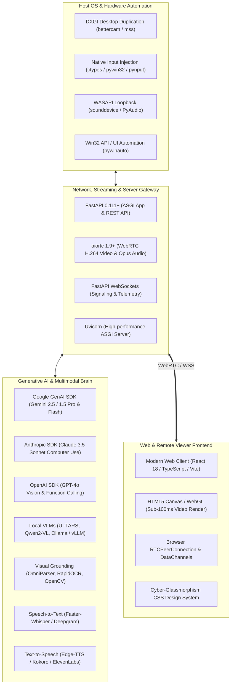
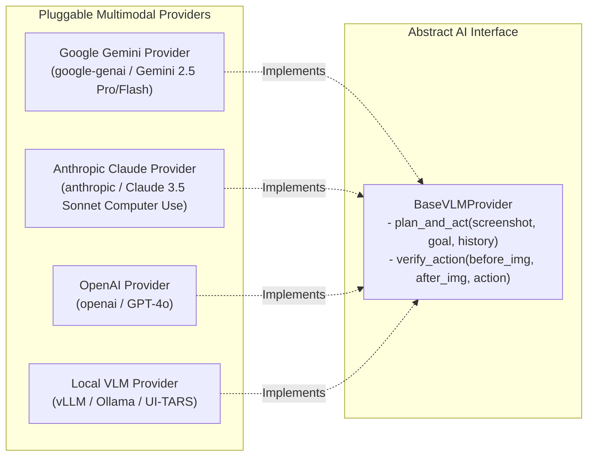

# Tech Stack & Engine Specification — AI Remote Desktop (AnyDesk Paradigm)

> **Status**: Approved Technology Standard  
> **Target Runtime**: Python 3.11+ / Node.js 20+ / Modern Web Standards  
> **Primary Host OS Target**: Windows 10/11 (with Linux & macOS cross-platform abstractions)

---

## 1. Technology Ecosystem Overview



---

## 2. Component-by-Component Technology Selection

### 2.1. Host Capture & Input Engine (`host_engine`)

| Functionality | Primary Library / Technology | Fallback / Alternative | Rationale |
| :--- | :--- | :--- | :--- |
| **High-Speed Screen Capture** | `bettercam` (DXGI GPU Duplication) | `mss`, `PIL.ImageGrab` | Captures at $> 60\text{ FPS}$ with $< 2\text{ms}$ CPU overhead using Direct3D 11 GPU buffer copies on Windows. |
| **Mouse & Keyboard Input** | `ctypes.windll.user32.SendInput` | `pyautogui`, `pynput` | Native OS system call bypassing user-level hooks for low-latency, hardware-level simulation without elevation bugs. |
| **Window & UI Metadata** | `pywin32` (`win32gui`, `win32process`) | `pywinauto` | Instant window title, PID, position, and focus queries without heavy UI accessibility tree traversals. |
| **System Audio Capture** | `sounddevice` / WASAPI Loopback | `PyAudio` | Captures remote desktop sound card output cleanly for WebRTC streaming. |

---

### 2.2. Web Server, Networking & Streaming Layer (`server`)

| Layer | Library / Tool | Specification / Details |
| :--- | :--- | :--- |
| **Web Framework** | `FastAPI` (v0.111+) | Asynchronous, auto-generates OpenAPI specs, native WebSockets, Pydantic v2 validation. |
| **ASGI Web Server** | `uvicorn` (with `uvloop` & `httptools`) | Production-ready, lightning-fast async event loop. |
| **Video Streaming** | `aiortc` (WebRTC implementation for Python) | Native WebRTC PeerConnection, H.264 / VP8 hardware encoder integration, RTP/SRTP encryption. |
| **Signaling & Telemetry** | `websockets` (via FastAPI WebSocket endpoints) | Full-duplex JSON-RPC 2.0 streaming for AI thoughts, logs, and telemetry. |
| **Security & Auth** | `python-jose` (JWT), `passlib` (Argon2) | Cryptographically secure token authentication with role-based access. |

---

### 2.3. Multimodal Generative AI & Vision Engine (`ai_brain`)



#### Detailed AI Stack Specifications:
1. **Google Gemini (Primary Recommended Cloud VLM)**:
   - SDK: `google-genai` (Latest Official 2025/2026 SDK) / `google-generativeai`.
   - Models: `gemini-2.5-pro` (Complex reasoning & multi-app workflows), `gemini-2.5-flash` (Ultra-low latency real-time visual navigation).
   - Features: Native multimodal image comprehension, structured JSON output via Pydantic schemas, system instructions.
2. **Anthropic Claude Computer Use (Specialized GUI Control)**:
   - SDK: `anthropic`.
   - Models: `claude-3-5-sonnet-20241022` with `computer-20241022` beta tool.
3. **Visual Grounding & Parsing**:
   - `RapidOCR` / `PaddleOCR`: Lightweight, high-accuracy offline text and bounding box detection.
   - `OmniParser` / `YOLOv8-UI`: UI element bounding box segmenter producing Set-of-Marks visual tags.
   - `Pillow` & `OpenCV` (`cv2`): Image resizing, cropping, grid-overlay drawing, and privacy region blurring.
4. **Voice Interaction Subsystem**:
   - **Speech-to-Text (STT)**: `faster-whisper` (local GPU/CPU real-time inference) or `deepgram-sdk`.
   - **Text-to-Speech (TTS)**: `edge-tts` (zero-cost, high quality Microsoft natural voices), `kokoro-onnx`, or `elevenlabs`.

---

### 2.4. Client Controller Web Interface (`client_web`)

| Technology | Role & Details |
| :--- | :--- |
| **Framework** | Modern Web Client (HTML5 / TypeScript / React 18+ / Vite) |
| **Design System** | Custom Vanilla CSS Design System with Cyber-Glassmorphism, Dark Mode tokens, and CSS Grid layouts. |
| **Canvas Renderer** | HTML5 `<canvas>` with 2D / WebGL contexts for zero-latency video rendering and visual bounding-box overlays. |
| **WebRTC Client** | Browser native `RTCPeerConnection`, `RTCDataChannel`, and `navigator.mediaDevices.getUserMedia` for microphone audio. |
| **State Management** | Lightweight reactive store (Zustand or native reactive signals). |
| **Icons & Typography** | `lucide-react` / Lucide Icons, Google Fonts (`Outfit`, `Inter`, `JetBrains Mono`). |

---

## 3. Dependency Manifest & Configuration

### 3.1. Python Dependencies (`requirements.txt`)

```text
# --- Web Framework & Networking ---
fastapi>=0.111.0
uvicorn[standard]>=0.30.0
websockets>=12.0
aiortc>=1.9.0
python-multipart>=0.0.9
pydantic>=2.7.0
pydantic-settings>=2.2.0

# --- OS Automation & Desktop Capture (Windows / Cross-platform) ---
bettercam>=0.2.1; sys_platform == 'win32'
mss>=9.0.1
pyautogui>=0.9.54
pynput>=1.7.6
pywin32>=306; sys_platform == 'win32'
sounddevice>=0.4.6
numpy>=1.26.4
opencv-python-headless>=4.9.0.80
pillow>=10.3.0

# --- Multimodal Generative AI SDKs ---
google-genai>=0.1.1
google-generativeai>=0.7.0
anthropic>=0.25.0
openai>=1.30.0

# --- Visual Grounding & OCR ---
rapidocr-onnxruntime>=1.3.18

# --- Voice & Audio Processing ---
faster-whisper>=1.0.2
edge-tts>=6.1.12

# --- Utilities & Security ---
python-jose[cryptography]>=3.3.0
passlib[bcrypt]>=1.7.4
pyyaml>=6.0.1
loguru>=0.7.2
rich>=13.7.1
aiofiles>=23.2.1
```
