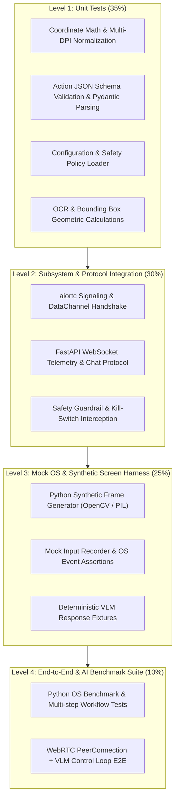
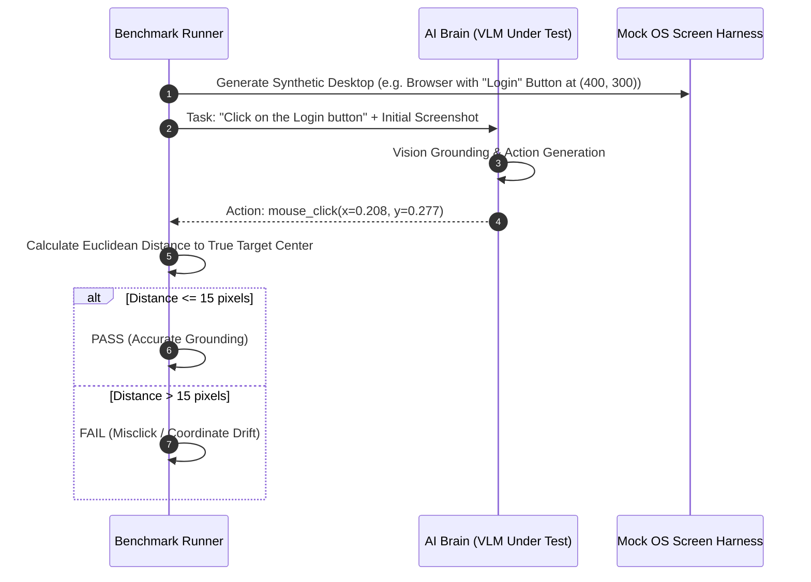

# Testing & Verification Specification — AI Remote Desktop (Python Engine)

> **Status**: Approved Testing Standard  
> **Target Frameworks**: `pytest`, `pytest-asyncio`, `pytest-mock`, Python Mock OS Harness

---

## 1. Python-Centric Verification Strategy & Pyramid



---

## 2. Test Suites & Specifications

---

### 2.1. Level 1: Unit Testing (Pure Python)

#### Test Target: Coordinate Math & Multi-DPI Normalization
- **File**: `tests/unit/test_coordinates.py`
- **Scope**: Verifies that normalized float coordinates $[u, v] \in [0.0, 1.0]$ translate deterministically to integer native screen coordinates across multiple monitors, DPI scales ($100\%, 125\%, 150\%, 200\%$), and letterboxed client canvas viewports.
- **Assertions**:
  - Normalized $(0.5, 0.5)$ on a $1920 \times 1080$ display at $100\%$ scaling yields $(960, 540)$.
  - Normalized $(0.5, 0.5)$ on Monitor 2 (Offset $X=1920, Y=0$, $2560 \times 1440$, $150\%$ DPI) yields $(1920 + 1920, 1080) = (3840, 1080)$.
  - Boundary clipping $[0.0, 1.0]$ prevents out-of-bounds coordinates ($< 0$ or $> \text{screen resolution}$).

#### Test Target: Action Schema & JSON-RPC Validation
- **File**: `tests/unit/test_action_parser.py`
- **Scope**: Tests parsing of raw LLM outputs (markdown code blocks, raw JSON, noisy text) into strongly-typed Pydantic action models.
- **Assertions**:
  - Valid `mouse_click`, `type_text`, `key_combination`, `scroll`, `drag`, `wait`, `terminate` schemas parse cleanly.
  - Malformed or hallucinated action types fail gracefully and return structured correction feedback to the VLM.

---

### 2.2. Level 2: Subsystem Integration Testing

#### Test Target: aiortc WebRTC & WebSocket Signaling
- **File**: `tests/integration/test_signaling.py`
- **Scope**: Tests SDP offer/answer exchange, ICE candidate propagation, session authentication, and WebRTC DataChannel connection lifecycle.
- **Assertions**:
  - Unauthorized clients receive `401 Unauthorized` on signaling handshake.
  - Valid token initiates WebRTC PeerConnection and opens `control` and `telemetry` DataChannels within $< 1000\text{ ms}$.

#### Test Target: Safety Guardrails & Emergency Kill-Switch
- **File**: `tests/integration/test_safety_guardrails.py`
- **Scope**: Verifies action risk classification (Tier 1 vs Tier 2 vs Tier 3) and kill-switch priority preemption.
- **Assertions**:
  - High-risk commands (`rm -rf`, `del /f /q`, `format`, password inputs) block execution and emit `HITL_REQUIRED` event.
  - Triggering `emergency_stop()` cancels any in-flight input sequence within $< 20\text{ ms}$ and rejects subsequent actions until reset.

---

### 2.3. Level 3: Mock OS & Synthetic Screen Harness

To enable automated CI/CD testing without moving the physical developer's mouse or requiring a real GUI desktop:

```python
# tests/mocks/mock_os_harness.py
import numpy as np
import cv2
import time

class MockScreenCapture:
    """Generates synthetic RGB frames with pre-drawn UI elements (buttons, inputs)."""
    def __init__(self, width: int = 1920, height: int = 1080):
        self.width = width
        self.height = height
        self.current_frame = np.zeros((height, width, 3), dtype=np.uint8)

    def draw_button(self, label: str, x: int, y: int, w: int, h: int):
        # Draws a simulated button for OCR and Grounding detection tests
        cv2.rectangle(self.current_frame, (x, y), (x + w, y + h), (50, 150, 250), -1)
        cv2.putText(self.current_frame, label, (x + 10, y + h - 10), cv2.FONT_HERSHEY_SIMPLEX, 0.7, (255, 255, 255), 2)

    def capture_frame(self) -> np.ndarray:
        return self.current_frame.copy()

class MockInputController:
    """Records simulated mouse and keyboard events for validation assertions."""
    def __init__(self):
        self.event_log = []

    def click(self, x: int, y: int, button: str = "left"):
        self.event_log.append({"type": "click", "x": x, "y": y, "button": button, "timestamp": time.time()})

    def type_text(self, text: str):
        self.event_log.append({"type": "type", "text": text, "timestamp": time.time()})
```

---

### 2.4. Level 4: Python AI Grounding & Benchmark Verification Suite



---

## 3. Automated Test Execution Commands

```bash
# Run all unit tests
pytest tests/unit -v

# Run integration tests with async support
pytest tests/integration -v

# Run mock OS harness & grounding verification
pytest tests/mocks -v

# Generate test coverage report
pytest --cov=src --cov-report=term-missing --cov-report=html
```
