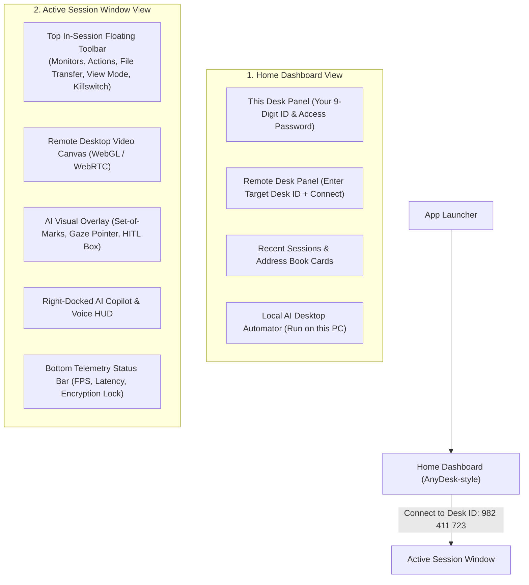

# UI/UX Design System & Layout Architecture (AnyDesk Paradigm)

> **Status**: Approved Design System  
> **Software Style**: High-Performance AnyDesk/RustDesk Controller + Multimodal Generative AI Copilot  
> **Aesthetic Theme**: Modern Cyber-Glassmorphism Dark Theme

---

## 1. Primary Views & Navigation Architecture

The software features two primary interfaces:
1. **The Launch Dashboard (Home View)**: "This Desk" ID generation, "Remote Desk" connection input, address book, and local AI agent triggers.
2. **The Active Session Controller (Remote View)**: Full-screen interactive remote desktop with the in-session AnyDesk floating toolbar and docked AI Copilot HUD.



---

## 2. View 1: Home Dashboard Wireframe (AnyDesk-style)

```
+----------------------------------------------------------------------------------------------------+
|  [Logo] ANTIGRAVITY DESK AI                                       [ - ] [ Square ] [ X ]           |
+----------------------------------------------------------------------------------------------------+
|                                                                                                    |
|   +---------------------------------------+       +---------------------------------------+        |
|   |  THIS DESK (Your Machine)             |       |  REMOTE DESK (Connect to PC)          |        |
|   |---------------------------------------|       |---------------------------------------|        |
|   |  Your Address:                        |       |  Enter Remote ID or Alias:            |        |
|   |  [ 982  411  723 ]   [ Copy ] [ QR ]  |       |  [ 123  456  789                 ]    |        |
|   |                                       |       |                                       |        |
|   |  Status: [ * Ready for Connection ]   |       |  Mode: [ AI Copilot + Manual Control v]|       |
|   |  Password: [ Set Unattended Access ]  |       |                                       |        |
|   |  Permissions: [ 6 Allowed v ]         |       |  [  CONNECT ->  ]   [ AI DELEGATE ]   |        |
|   +---------------------------------------+       +---------------------------------------+        |
|                                                                                                    |
|   RECENT SESSIONS & SAVED DESKS                                                                    |
|   +-------------------+  +-------------------+  +-------------------+  +-------------------+       |
|   | [PC] Office-Win11 |  | [PC] Linux-Server |  | [Mac] Studio-M2   |  | [AI] Local Worker |       |
|   | ID: 492 102 381   |  | ID: 819 391 002   |  | ID: 772 491 553   |  | ID: (Self / Loop) |       |
|   | Ping: 18ms [Online|  | Ping: 42ms [Online|  | [Offline]         |  | Ready to Automate |       |
|   | [ Connect ]       |  | [ Connect ]       |  | [ Reconnect ]     |  | [ Start Agent ]   |       |
|   +-------------------+  +-------------------+  +-------------------+  +-------------------+       |
|                                                                                                    |
+----------------------------------------------------------------------------------------------------+
```

---

## 3. View 2: Active Remote Desktop Session View

```
+----------------------------------------------------------------------------------------------------+
|  [Session: Office-Win11 | 982 411 723]   [Mon 1 v] [View 100% v] [File Xfer] [Actions v]  [🛑 STOP]|
+--------------------------------------------------------------------+-------------------------------+
|                                                                    |  [ AI COPILOT COMMAND CENTER] |
|                                                                    |  Tabs: [AI Agent] [Chat] [Log]|
|                                                                    |-------------------------------|
|                                                                    |  PROMPT GOAL:                 |
|                                                                    |  [ "Download invoice #402 and |
|                     REMOTE DESKTOP CANVAS                          |    save to Accounting folder" ]
|                                                                    |  [ Run Autonomous ] [ Voice ] |
|              (Low-latency WebRTC Video Stream)                     |-------------------------------|
|                                                                    |  REASONING TRACE:             |
|              +------------------------------+                      |  > [14:52:01] Taking snapshot |
|              | AI Focus Gaze (X: 520, Y: 310)|                     |  > [14:52:02] Found 'Download'|
|              | [ Tag #12: "Download PDF" ]  |                      |    button at box [12]         |
|              +------------------------------+                      |  > [14:52:03] Clicking #12...|
|                                                                    |  > [14:52:04] Verifying file  |
|                                                                    |-------------------------------|
|                                                                    |  [ ⚠️ HITL APPROVAL MODAL ]   |
|                                                                    |  Approve File Move to D:\?    |
|                                                                    |  [ Reject ]      [ Approve ]  |
+--------------------------------------------------------------------+-------------------------------+
|  [🔒 Encrypted DTLS-SRTP]  [60 FPS]  [32 ms Ping]  [4.2 Mbps]  [Audio: On]  [Clip Sync: Active]    |
+----------------------------------------------------------------------------------------------------+
```

---

## 4. In-Session Floating Toolbar Details

The top floating toolbar matches AnyDesk's streamlined layout with modern glassmorphism styling:

| Icon / Tool | Dropdown / Action | Description |
| :--- | :--- | :--- |
| **Monitors** | `[Monitor 1]`, `[Monitor 2]`, `[Multi-View]` | Instant remote display switching |
| **View Mode** | `Original (1:1)`, `Fit to Window`, `Stretch` | Canvas scaling & DPI compensation |
| **File Transfer** | Opens Split-Pane File Manager modal | Upload/download files with drag-and-drop |
| **Actions Menu** | `Send Ctrl+Alt+Del`, `Lock Machine`, `Open Task Manager`, `Request Elevation (UAC)` | Sends native OS control signals |
| **AI Copilot** | Toggle Right-Side AI HUD & Set-of-Marks | Opens/closes AI Agent reasoning sidebar |
| **Permissions** | Live toggle checkboxes for Mouse/Keys, Audio, Clipboard | Real-time security permission adjustment |
| **Kill Switch** | `[ 🛑 EMERGENCY STOP ]` | Instantly aborts AI inputs and releases locks |

---

## 5. Design System Tokens & Glassmorphism Styling

```css
:root {
  /* Surface Dark Palette */
  --bg-desk-base: #080C14;
  --bg-desk-panel: #0E1626;
  --bg-desk-card: rgba(18, 28, 48, 0.70);
  --bg-glass-heavy: rgba(14, 22, 38, 0.85);

  /* AnyDesk & AI Accent Brand */
  --accent-anydesk-red: #EF4444;    /* Classic AnyDesk red accent for quick recognition */
  --accent-ai-cyan: #00F0FF;        /* Futuristic AI copilot cyan */
  --accent-ai-violet: #8B5CF6;      /* Autonomous reasoning violet */

  /* Telemetry Status Colors */
  --status-online: #10B981;
  --status-connecting: #F59E0B;
  --status-offline: #64748B;
  --status-danger: #FF3366;

  /* Typography */
  --font-sans: 'Inter', -apple-system, sans-serif;
  --font-display: 'Outfit', sans-serif;
  --font-mono: 'JetBrains Mono', monospace;
}
```
